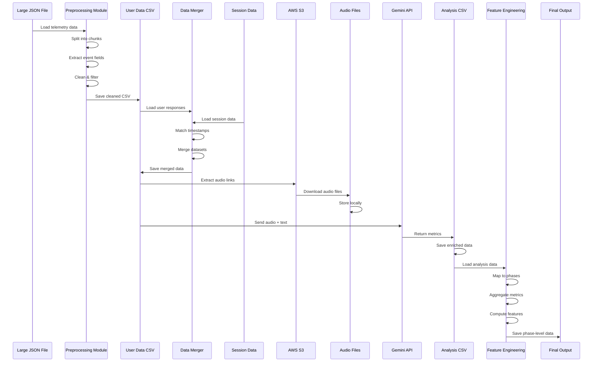
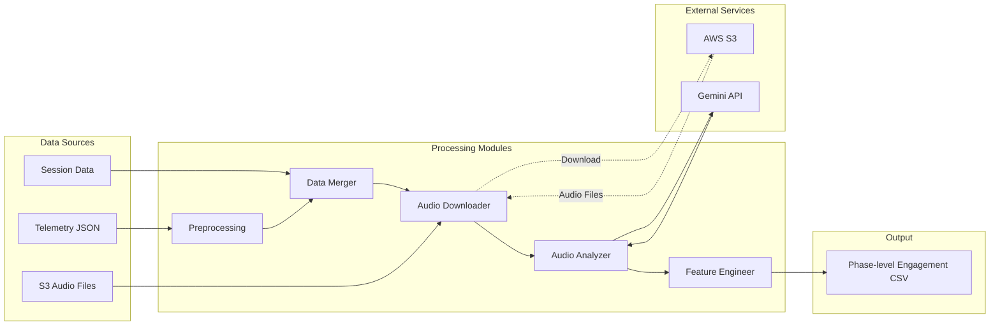

# Engagement Prediction System - Architecture Document

## Table of Contents
1. [Overview](#overview)
2. [System Architecture](#system-architecture)
3. [Data Flow](#data-flow)
4. [Component Details](#component-details)
5. [Technology Stack](#technology-stack)
6. [Architecture Diagram](#architecture-diagram)

---

## Overview

The Engagement Prediction System is designed to analyze user engagement in language learning applications by processing telemetry data, audio responses, and session information. The system extracts emotional and engagement metrics from audio files and aggregates them at various granularities (response-level, phase-level) to provide insights into user learning patterns.

### Key Objectives
- Process large-scale telemetry data efficiently
- Extract engagement metrics from audio responses using AI
- Aggregate and analyze engagement patterns at phase and session levels
- Generate actionable insights for user engagement prediction

---

## System Architecture

The system follows a **batch processing pipeline architecture** with the following stages:

```
Raw Telemetry Data → Preprocessing → Data Merging → Audio Processing → Feature Engineering → Engagement Insights
```

### Architecture Layers

1. **Data Ingestion Layer**: Handles large JSON telemetry files
2. **Data Processing Layer**: Cleans, transforms, and structures raw data
3. **Data Integration Layer**: Merges multiple data sources
4. **Audio Processing Layer**: Downloads and analyzes audio files
5. **Feature Engineering Layer**: Creates aggregated features for prediction
6. **Output Layer**: Generates phase-level engagement metrics

---

## Data Flow

### Stage 1: Data Ingestion & Preprocessing
**Component**: `engagementpredictorpreprocessing.py`

**Input**: 
- Large JSON telemetry file (`all_telemetry_full.json`)

**Process**:
1. **JSON Splitting**: Large JSON files are split into manageable chunks (200K records per chunk)
   - Detects JSON format (array vs JSONL)
   - Uses streaming parser (`ijson`) for memory efficiency
   - Creates manifest file for tracking

2. **Data Extraction**: Extracts key fields from nested event structures
   - User ID (from `context.cdata` or `actor.id`)
   - Language preference
   - Original text (expected response)
   - Audio link (S3 path)
   - Response text (actual response)
   - Accuracy percentage

3. **Data Cleaning**:
   - Removes unnecessary columns (`api_id`, `ver`, `params`, `ets`, `channel`, `pid`, `mid`, `syncts`)
   - Filters for English language only
   - Normalizes timestamps (handles MongoDB `$date` format)
   - Converts to CSV format for easier processing

**Output**: 
- Cleaned CSV files per chunk (`chunk_XXX_clean.csv`)

---

### Stage 2: User Data Extraction
**Component**: `engagementpredictorpreprocessing.py` (user filtering section)

**Process**:
1. Merges cleaned chunks
2. Filters data for specific users
3. Saves user-specific datasets

**Output**: 
- `user_<user_id>_data.csv`

---

### Stage 3: Data Merging
**Component**: `combined_data_for_a_user.py`

**Input**:
- User response data (`user_<user_id>_data.csv`)
- Session data (`<user_id>_learnerai_data.csv`)

**Process**:
1. **Timestamp Normalization**: Converts timestamps to datetime, removes timezone info
2. **Session Matching**: Matches responses to sessions using nearest timestamp (within ±5 minutes)
3. **Data Merging**: Combines response data with session metadata
   - Session ID
   - Milestone Level
   - Lesson information
   - Progress percentage

**Output**: 
- `merged_user_<user_id>_data_engagement_data.csv`

**Key Fields**:
- `UserId`, `SessionId`, `MilestoneLevel`, `Lesson`, `Progress`
- `CreatedAt_Response`, `CreatedAt_Session`
- `original_text`, `response_text`, `accuracy_percentage`
- `audio_link`

---

### Stage 4: Audio Download
**Component**: `download_audios_from_s3.py`

**Input**:
- Merged CSV with `audio_link` column

**Process**:
1. **S3 Connection**: Connects to AWS S3 using boto3
2. **Batch Processing**: Downloads audio files in batches (1000 files per batch)
3. **Concurrent Downloads**: Uses ThreadPoolExecutor (25 workers) for parallel downloads
4. **Retry Logic**: Implements retry mechanism (3 attempts) with exponential backoff
5. **Progress Tracking**: Logs download progress, failures, and statistics

**Features**:
- Pre-signed URL generation for secure access
- Atomic file writes (temp file → rename)
- Skips already downloaded files
- Detailed error logging per batch

**Output**: 
- Audio files in `audios/` directory
- Download logs (`download_log_<timestamp>.log`)
- Failure reports (`failed_downloads_batch_<N>.json`)

---

### Stage 5: Audio Analysis
**Component**: `Data_operations/LLM_for_audio/batch_audio_analysis.py`

**Input**:
- Merged CSV with audio links
- Downloaded audio files

**Process**:
1. **Gemini API Integration**: Uses Google Gemini 2.0 Flash Lite model
2. **Audio Analysis**: For each audio file:
   - Validates file existence and size
   - Sends audio + original text to Gemini API
   - Extracts structured JSON response

3. **Metrics Extracted**:
   - **EQ Score** (0-100): Emotional Quotient
   - **Engagement Score** (0-100): Engagement level
   - **Dominant Emotion**: happiness, sadness, anger, fear, calmness
   - **Engagement State**: engaged, neutral, disengaged
   - **Pronunciation Accuracy**: good, average, poor
   - **Audio Quality**: good, poor, distorted, blank

4. **Rate Limiting**: 
   - 8-second delay between requests
   - Retry logic for rate limit errors (429)
   - Incremental saving every 5 processed files

**Output**: 
- `merged_with_analysis.csv` (enriched with engagement metrics)

**Key Features**:
- Handles missing/invalid audio files gracefully
- Skips empty or corrupted files
- Continues processing on API errors
- Supports resume from interruption

---

### Stage 6: Feature Engineering
**Component**: `final_with_feature_engineering.py`

**Input**:
- `merged_with_analysis.csv` (with engagement metrics)

**Process**:
1. **Phase Mapping**: Maps progress percentage to learning phases
   ```
   10 → P1, 20 → P2, 30 → P3, 40 → P4,
   50 → S1, 60 → P5, 70 → P6, 80 → P7, 90 → P8, 0 → S2
   ```

2. **Phase-Level Aggregation**: Groups by `(UserId, SessionId, MilestoneLevel, Phase)`
   - **Temporal Metrics**:
     - `start_time`: Minimum session timestamp
     - `end_time`: Maximum response timestamp
     - `session_duration_mins`: Phase duration in minutes
     - `gap_to_next_mins`: Time gap to next phase
   
   - **Response Metrics**:
     - `num_responses`: Count of responses in phase
     - `avg_accuracy`: Mean accuracy percentage
     - `avg_EQ`: Mean Emotional Quotient
     - `avg_Engagement`: Mean Engagement Score
   
   - **Categorical Metrics** (mode):
     - `dominant_emotion`
     - `engagement_state`
     - `pronunciation_accuracy`
     - `audio_quality`

3. **Composite Score**: 
   - `EQ_Accuracy_Score = 0.6 * avg_EQ + 0.4 * avg_accuracy`

**Output**: 
- `phase_level_engagement_full.csv`

**Key Fields**:
- `UserId`, `SessionId`, `MilestoneLevel`, `Phase`
- `start_time`, `end_time`, `session_duration_mins`, `gap_to_next_mins`
- `num_responses`, `avg_accuracy`, `avg_EQ`, `avg_Engagement`
- `EQ_Accuracy_Score`
- `dominant_emotion`, `engagement_state`, `pronunciation_accuracy`, `audio_quality`

---

## Component Details

### 1. Data Preprocessing Module
**File**: `engagementpredictorpreprocessing.py`

**Responsibilities**:
- Handle large JSON files efficiently
- Extract nested event data
- Filter and clean telemetry records
- Convert to structured CSV format

**Key Functions**:
- `detect_json_format()`: Detects JSON array vs JSONL format
- `split_jsonl_format()`: Fast line-by-line processing for JSONL
- `split_array_format_ijson()`: Streaming parser for JSON arrays
- `extract_event_fields()`: Extracts user_id, language, text, audio links
- `process_chunk()`: Complete cleaning pipeline per chunk

---

### 2. Data Merging Module
**File**: `combined_data_for_a_user.py`

**Responsibilities**:
- Merge user response data with session metadata
- Match responses to sessions using temporal proximity
- Normalize timestamps and column names

**Key Functions**:
- `assign_nearest_session()`: Matches responses to sessions within time window

---

### 3. Audio Download Module
**File**: `download_audios_from_s3.py`

**Responsibilities**:
- Download audio files from S3 in parallel
- Handle retries and errors gracefully
- Track download progress and statistics

**Key Classes**:
- `ProductionS3Downloader`: Main downloader class with retry logic

**Configuration**:
- `MAX_WORKERS = 25`: Concurrent download threads
- `BATCH_SIZE = 1000`: Files per batch
- `TIMEOUT = 120`: Seconds per file
- `RETRY_ATTEMPTS = 3`: Retry attempts per file

---

### 4. Audio Analysis Module
**File**: `Data_operations/LLM_for_audio/batch_audio_analysis.py`

**Responsibilities**:
- Analyze audio files using Gemini AI
- Extract engagement and emotional metrics
- Handle API rate limits and errors

**Key Functions**:
- `process_audio()`: Sends audio to Gemini API and parses response
- `clean_json_response()`: Cleans JSON from API response
- `safe_json_parse()`: Safe JSON parsing with error handling

**API Configuration**:
- Model: `gemini-2.0-flash-lite`
- Delay: 8 seconds between requests
- Retries: 3 attempts with 60-second delay on rate limit

---

### 5. Feature Engineering Module
**File**: `final_with_feature_engineering.py`

**Responsibilities**:
- Aggregate engagement metrics at phase level
- Compute temporal features (duration, gaps)
- Create composite scores

**Key Functions**:
- `compute_phase_gaps()`: Calculates time gaps between consecutive phases

---

## Technology Stack

### Core Technologies
- **Python 3.x**: Primary programming language
- **Pandas**: Data manipulation and analysis
- **NumPy**: Numerical computations

### Data Processing
- **ijson**: Streaming JSON parser for large files
- **boto3**: AWS S3 integration for audio downloads
- **requests**: HTTP client for S3 pre-signed URLs

### AI/ML
- **google-genai**: Google Gemini API client for audio analysis

### Utilities
- **tqdm**: Progress bars for long-running operations
- **concurrent.futures**: Parallel processing (ThreadPoolExecutor)

### Data Storage
- **CSV**: Primary data format for intermediate and final outputs
- **JSON**: Input telemetry format
- **AWS S3**: Audio file storage

---

## Architecture Diagram

### Visual Flow Diagram (Mermaid)

```mermaid
graph TB
    subgraph "Stage 1: Data Ingestion & Preprocessing"
        A[Large JSON Telemetry File<br/>all_telemetry_full.json] --> B[engagementpredictorpreprocessing.py]
        B --> B1[JSON Format Detection]
        B1 --> B2[Chunk Splitting<br/>200K records/chunk]
        B2 --> B3[Event Field Extraction]
        B3 --> B4[Data Cleaning & Filtering]
        B4 --> C[Cleaned CSV Chunks<br/>chunk_XXX_clean.csv]
    end

    subgraph "Stage 2: User Data Extraction"
        C --> D[User Filtering & Merging]
        D --> E[User-specific CSV<br/>user_<id>_data.csv]
    end

    subgraph "Stage 3: Data Merging"
        E --> F[combined_data_for_a_user.py]
        G[Session Data CSV<br/><id>_learnerai_data.csv] --> F
        F --> F1[Timestamp Normalization]
        F1 --> F2[Session Matching<br/>±5 min window]
        F2 --> F3[Data Merging]
        F3 --> H[Merged Dataset<br/>merged_user_<id>_data_engagement_data.csv]
    end

    subgraph "Stage 4: Audio Download"
        H --> I[download_audios_from_s3.py]
        I --> I1[S3 Connection<br/>boto3]
        I1 --> I2[Batch Processing<br/>1000 files/batch]
        I2 --> I3[Parallel Downloads<br/>25 workers]
        I3 --> J[AWS S3 Bucket]
        J --> K[Local Audio Files<br/>audios/ directory]
    end

    subgraph "Stage 5: Audio Analysis"
        H --> L[batch_audio_analysis.py]
        K --> L
        L --> L1[Gemini API Integration]
        L1 --> L2[Audio + Text Analysis]
        L2 --> M[Google Gemini 2.0<br/>Flash Lite Model]
        M --> N[Extracted Metrics:<br/>EQ Score, Engagement Score,<br/>Emotion, Pronunciation, etc.]
        N --> O[Enriched Dataset<br/>merged_with_analysis.csv]
    end

    subgraph "Stage 6: Feature Engineering"
        O --> P[final_with_feature_engineering.py]
        P --> P1[Phase Mapping<br/>Progress → Phase]
        P1 --> P2[Phase-Level Aggregation]
        P2 --> P3[Temporal Features<br/>Duration, Gaps]
        P3 --> P4[Composite Scores<br/>EQ-Accuracy]
        P4 --> Q[Final Output<br/>phase_level_engagement_full.csv]
    end

    style A fill:#e1f5ff
    style Q fill:#d4edda
    style M fill:#fff3cd
    style J fill:#f8d7da
```



### Sequence Diagram



### System Component Interaction



### Detailed Component Diagram

```
┌─────────────────────────────────────────────────────────────────────────┐
│                    ENGAGEMENT PREDICTION SYSTEM                          │
└─────────────────────────────────────────────────────────────────────────┘

┌─────────────────────────────────────────────────────────────────────────┐
│ STAGE 1: DATA INGESTION & PREPROCESSING                                 │
├─────────────────────────────────────────────────────────────────────────┤
│                                                                           │
│  ┌──────────────────┐                                                    │
│  │ all_telemetry_   │                                                    │
│  │ full.json        │                                                    │
│  │ (Large JSON)     │                                                    │
│  └────────┬─────────┘                                                    │
│           │                                                               │
│           ▼                                                               │
│  ┌─────────────────────────────────────┐                                │
│  │ engagementpredictorpreprocessing.py  │                                │
│  │                                      │                                │
│  │ • JSON Format Detection              │                                │
│  │ • Chunk Splitting (200K records)      │                                │
│  │ • Event Field Extraction             │                                │
│  │ • Data Cleaning                      │                                │
│  │ • Language Filtering (English only)   │                                │
│  └────────┬─────────────────────────────┘                                │
│           │                                                               │
│           ▼                                                               │
│  ┌──────────────────┐                                                    │
│  │ chunk_XXX_clean. │                                                    │
│  │ csv              │                                                    │
│  └──────────────────┘                                                    │
└─────────────────────────────────────────────────────────────────────────┘

┌─────────────────────────────────────────────────────────────────────────┐
│ STAGE 2: USER DATA EXTRACTION                                            │
├─────────────────────────────────────────────────────────────────────────┤
│                                                                           │
│  ┌──────────────────┐                                                    │
│  │ Cleaned Chunks   │                                                    │
│  └────────┬─────────┘                                                    │
│           │                                                               │
│           ▼                                                               │
│  ┌─────────────────────────────────────┐                                │
│  │ User Filtering & Merging            │                                │
│  │ • Merge all chunks                  │                                │
│  │ • Filter by user_id                 │                                │
│  └────────┬─────────────────────────────┘                                │
│           │                                                               │
│           ▼                                                               │
│  ┌──────────────────┐                                                    │
│  │ user_<id>_data.  │                                                    │
│  │ csv              │                                                    │
│  └──────────────────┘                                                    │
└─────────────────────────────────────────────────────────────────────────┘

┌─────────────────────────────────────────────────────────────────────────┐
│ STAGE 3: DATA MERGING                                                    │
├─────────────────────────────────────────────────────────────────────────┤
│                                                                           │
│  ┌──────────────────┐      ┌──────────────────┐                         │
│  │ user_<id>_data.  │      │ <id>_learnerai_  │                         │
│  │ csv              │      │ data.csv         │                         │
│  │ (Responses)      │      │ (Sessions)       │                         │
│  └────────┬─────────┘      └────────┬─────────┘                         │
│           │                          │                                    │
│           └──────────┬───────────────┘                                    │
│                      ▼                                                    │
│           ┌──────────────────────────────┐                                │
│           │ combined_data_for_a_user.py  │                                │
│           │                              │                                │
│           │ • Timestamp Normalization    │                                │
│           │ • Session Matching           │                                │
│           │   (±5 min window)            │                                │
│           │ • Data Merging               │                                │
│           └────────┬─────────────────────┘                                │
│                    │                                                       │
│                    ▼                                                       │
│           ┌──────────────────────────────┐                                │
│           │ merged_user_<id>_data_       │                                │
│           │ engagement_data.csv          │                                │
│           └──────────────────────────────┘                                │
└─────────────────────────────────────────────────────────────────────────┘

┌─────────────────────────────────────────────────────────────────────────┐
│ STAGE 4: AUDIO DOWNLOAD                                                  │
├─────────────────────────────────────────────────────────────────────────┤
│                                                                           │
│  ┌──────────────────────────────┐                                        │
│  │ merged_user_<id>_data_       │                                        │
│  │ engagement_data.csv          │                                        │
│  │ (with audio_link column)     │                                        │
│  └────────┬─────────────────────┘                                        │
│           │                                                               │
│           ▼                                                               │
│  ┌─────────────────────────────────────┐                                │
│  │ download_audios_from_s3.py          │                                │
│  │                                      │                                │
│  │ • S3 Connection (boto3)              │                                │
│  │ • Batch Processing (1000/batch)      │                                │
│  │ • Parallel Downloads (25 workers)     │                                │
│  │ • Retry Logic (3 attempts)            │                                │
│  │ • Progress Tracking                  │                                │
│  └────────┬─────────────────────────────┘                                │
│           │                                                               │
│           ▼                                                               │
│  ┌──────────────────┐                                                    │
│  │ AWS S3 Bucket    │                                                    │
│  │ (Audio Files)    │                                                    │
│  └────────┬─────────┘                                                    │
│           │                                                               │
│           ▼                                                               │
│  ┌──────────────────┐                                                    │
│  │ audios/          │                                                    │
│  │ (Local Storage)  │                                                    │
│  └──────────────────┘                                                    │
└─────────────────────────────────────────────────────────────────────────┘

┌─────────────────────────────────────────────────────────────────────────┐
│ STAGE 5: AUDIO ANALYSIS                                                  │
├─────────────────────────────────────────────────────────────────────────┤
│                                                                           │
│  ┌──────────────────────────────┐      ┌──────────────────┐             │
│  │ merged_user_<id>_data_       │      │ audios/          │             │
│  │ engagement_data.csv          │      │ (Audio Files)    │             │
│  └────────┬─────────────────────┘      └────────┬─────────┘             │
│           │                                     │                         │
│           └──────────┬──────────────────────────┘                         │
│                      ▼                                                    │
│           ┌─────────────────────────────────────┐                        │
│           │ batch_audio_analysis.py              │                        │
│           │                                      │                        │
│           │ • Gemini API Integration             │                        │
│           │ • Audio + Text Analysis              │                        │
│           │ • Rate Limiting (8s delay)           │                        │
│           │ • Error Handling & Retries           │                        │
│           └────────┬─────────────────────────────┘                        │
│                    │                                                       │
│                    ▼                                                       │
│           ┌─────────────────────────────────────┐                        │
│           │ Google Gemini 2.0 Flash Lite        │                        │
│           │ (AI Model)                           │                        │
│           └────────┬─────────────────────────────┘                        │
│                    │                                                       │
│                    ▼                                                       │
│           ┌─────────────────────────────────────┐                        │
│           │ Extracted Metrics:                  │                        │
│           │ • EQ Score (0-100)                  │                        │
│           │ • Engagement Score (0-100)           │                        │
│           │ • Dominant Emotion                   │                        │
│           │ • Engagement State                   │                        │
│           │ • Pronunciation Accuracy             │                        │
│           │ • Audio Quality                      │                        │
│           └────────┬─────────────────────────────┘                        │
│                    │                                                       │
│                    ▼                                                       │
│           ┌──────────────────────────────┐                                │
│           │ merged_with_analysis.csv     │                                │
│           │ (Enriched Dataset)           │                                │
│           └──────────────────────────────┘                                │
└─────────────────────────────────────────────────────────────────────────┘

┌─────────────────────────────────────────────────────────────────────────┐
│ STAGE 6: FEATURE ENGINEERING                                             │
├─────────────────────────────────────────────────────────────────────────┤
│                                                                           │
│  ┌──────────────────────────────┐                                        │
│  │ merged_with_analysis.csv     │                                        │
│  └────────┬─────────────────────┘                                        │
│           │                                                               │
│           ▼                                                               │
│  ┌─────────────────────────────────────┐                                │
│  │ final_with_feature_engineering.py   │                                │
│  │                                      │                                │
│  │ • Phase Mapping (Progress → Phase)   │                                │
│  │ • Phase-Level Aggregation            │                                │
│  │ • Temporal Feature Computation       │                                │
│  │ • Composite Score Calculation       │                                │
│  └────────┬─────────────────────────────┘                                │
│           │                                                               │
│           ▼                                                               │
│  ┌─────────────────────────────────────┐                                │
│  │ phase_level_engagement_full.csv     │                                │
│  │                                      │                                │
│  │ Final Output:                        │                                │
│  │ • Phase-level metrics                │                                │
│  │ • Session duration                   │                                │
│  │ • Gap between phases                 │                                │
│  │ • Aggregated engagement scores       │                                │
│  │ • Composite EQ-Accuracy score        │                                │
│  └─────────────────────────────────────┘                                │
└─────────────────────────────────────────────────────────────────────────┘

┌─────────────────────────────────────────────────────────────────────────┐
│ DATA FLOW SUMMARY                                                        │
├─────────────────────────────────────────────────────────────────────────┤
│                                                                           │
│  Raw Telemetry → Preprocessing → User Filtering → Data Merging →        │
│  Audio Download → Audio Analysis → Feature Engineering → Final Output   │
│                                                                           │
│  Input:  Large JSON telemetry file                                      │
│  Output: Phase-level engagement metrics CSV                              │
│                                                                           │
└─────────────────────────────────────────────────────────────────────────┘
```

---

## Key Design Decisions

### 1. Chunking Strategy
- **Rationale**: Large JSON files cannot be loaded into memory entirely
- **Implementation**: Streaming parser with 200K records per chunk
- **Benefit**: Memory-efficient processing of multi-GB files

### 2. Temporal Matching
- **Rationale**: Responses and sessions may not have exact timestamp matches
- **Implementation**: Nearest timestamp matching within ±5 minute window
- **Benefit**: Handles slight timing discrepancies in data collection

### 3. Parallel Audio Downloads
- **Rationale**: Sequential downloads would be too slow for thousands of files
- **Implementation**: 25 concurrent workers with batch processing
- **Benefit**: Significantly reduced download time

### 4. Incremental Processing
- **Rationale**: Long-running processes may be interrupted
- **Implementation**: Progress saving every 5 files, skip already processed
- **Benefit**: Resume capability without reprocessing

### 5. Phase-Level Aggregation
- **Rationale**: Individual responses are too granular for engagement prediction
- **Implementation**: Aggregate by (UserId, SessionId, MilestoneLevel, Phase)
- **Benefit**: Provides meaningful patterns for prediction models

---

## Error Handling & Resilience

### Data Processing
- Graceful handling of missing fields
- Skip invalid records with logging
- Continue processing on individual file errors

### Audio Downloads
- Retry mechanism (3 attempts) with exponential backoff
- Detailed failure logging per batch
- Skip already downloaded files

### API Calls
- Rate limit handling with retries
- Delay between requests (8 seconds)
- Continue processing on API errors

---

## Performance Considerations

### Memory Management
- Streaming JSON parsing for large files
- Chunk-based processing
- CSV format for intermediate storage

### Parallelization
- Multi-threaded audio downloads
- Batch processing for API calls
- Efficient pandas operations

### Scalability
- Handles files of any size through chunking
- Configurable batch sizes and worker counts
- Progress tracking for long-running operations

---

## Future Enhancements

1. **Real-time Processing**: Stream processing for live engagement monitoring
2. **Model Training**: Use phase-level features to train engagement prediction models
3. **Dashboard**: Visualization of engagement patterns
4. **Alerting**: Notifications for low engagement phases
5. **A/B Testing**: Compare engagement across different interventions

---

## Dependencies

See `requirements.txt` for complete list:
- boto3 (AWS S3)
- pandas (Data processing)
- numpy (Numerical operations)
- google-genai (Gemini API)
- tqdm (Progress bars)
- requests (HTTP client)
- ijson (Streaming JSON parser)

---

## Contact & Maintenance

For questions or issues related to the architecture, please refer to the codebase documentation or contact the development team.

---

**Document Version**: 1.0  
**Last Updated**: 2024  
**Maintained By**: ALL Engagement Prediction Team

