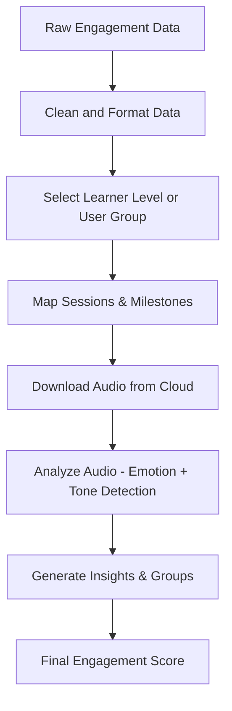
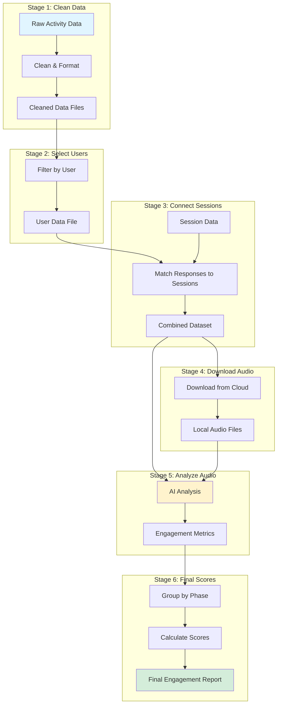

# 📘 Engagement Prediction System  

### **Client Documentation**

---

## 📌 Overview

The Engagement Prediction System is built to understand how learners interact with a language-learning product.  

It analyzes:
- Learner activity
- Audio responses
- Progress and milestone behavior  

The result is an insight-driven engagement score for each phase of learning.

---

## 🎯 Objectives

- Process raw learner activity  
- Analyze audio tone and response behavior  
- Connect responses to session milestones  
- Generate an engagement score for each learning stage  

---

## 🧠 System Workflow (High Level)



---

## 📊 How It Works

The system processes data in 6 stages:

### Stage 1: Clean Raw Data
**What happens:**
- Takes large files of learner activity
- Breaks them into smaller, manageable pieces
- Extracts important information (user ID, language, audio links, responses)
- Keeps only English language data
- Saves cleaned data files

**Input:** Large activity log file  
**Output:** Cleaned data files organized by chunks

---

### Stage 2: Select User Data
**What happens:**
- Combines all cleaned data chunks
- Filters for specific learners or user groups
- Creates individual learner files

**Input:** Cleaned data chunks  
**Output:** Learner-specific data file

---

### Stage 3: Connect Sessions
**What happens:**
- Takes learner responses and session information
- Matches responses to learning sessions (within 5 minutes)
- Combines response data with session details (milestone, lesson, progress)

**Input:** Learner responses + Session data  
**Output:** Combined dataset with responses linked to sessions

**How matching works:**
- Matches by User ID (exact match)
- Finds the closest session time within 5 minutes
- Links responses to their corresponding learning session

---

### Stage 4: Download Audio Files
**What happens:**
- Reads audio file links from the combined dataset
- Downloads audio files from cloud storage (AWS S3)
- Saves files locally for analysis
- Handles errors and retries automatically

**Input:** Combined dataset with audio links  
**Output:** Local audio files ready for analysis

---

### Stage 5: Analyze Audio
**What happens:**
- Sends each audio file to AI analysis service (Google Gemini)
- Analyzes tone, emotion, and engagement from voice
- Extracts metrics:
  - **Emotional Score** (0-100): How well learner manages emotions
  - **Engagement Score** (0-100): How engaged the learner sounds
  - **Dominant Emotion**: Happy, sad, calm, etc.
  - **Engagement State**: Engaged, neutral, or disengaged
  - **Pronunciation Quality**: Good, average, or poor
  - **Audio Quality**: Good, poor, or distorted

**Input:** Combined dataset + Audio files  
**Output:** Dataset enriched with engagement metrics

---

### Stage 6: Create Final Scores
**What happens:**
- Groups data by learning phase (P1, P2, P3, etc.)
- Calculates average scores per phase
- Computes time-based features (session duration, gaps between phases)
- Creates final engagement score combining emotion and accuracy

**Input:** Dataset with engagement metrics  
**Output:** Phase-level engagement scores (final result)

---

## 🔄 Complete Data Flow

```
Raw Activity Data 
  → Clean & Format 
  → Select Learners 
  → Connect to Sessions 
  → Download Audio 
  → Analyze Audio (AI) 
  → Calculate Phase Scores 
  → Final Engagement Report
```

---

## 📁 Key Files & Their Purpose

| File | Purpose |
|------|---------|
| `engagementpredictorpreprocessing.py` | Cleans raw activity data |
| `combined_data_for_a_user.py` | Connects responses to sessions |
| `download_audios_from_s3.py` | Downloads audio files |
| `batch_audio_analysis.py` | Analyzes audio with AI |
| `final_with_feature_engineering.py` | Creates final engagement scores |

---

## 🎨 Visual System Flow



---

## 🔑 Key Features

### Smart Matching
- Automatically matches learner responses to sessions
- Handles timing differences (up to 5 minutes)
- Groups multiple responses to the same session

### Audio Analysis
- Uses advanced AI to understand voice tone and emotion
- Detects engagement level from audio quality
- Evaluates pronunciation accuracy

### Phase-Based Insights
- Organizes data by learning phases (P1-P8, S1-S2)
- Calculates average engagement per phase
- Tracks time spent and gaps between phases

### Error Handling
- Continues processing even if some files fail
- Retries failed downloads automatically
- Saves progress so work isn't lost

---

## 📈 Output Information

The final output includes:

**Per Learning Phase:**
- Number of responses
- Average accuracy
- Average emotional score
- Average engagement score
- Dominant emotion
- Engagement state
- Session duration
- Time gap to next phase
- Combined engagement-accuracy score

**Use Cases:**
- Identify which phases learners struggle with
- Understand emotional patterns during learning
- Track engagement trends over time
- Make data-driven decisions to improve learning experience

---

## ⚙️ System Requirements

**Data Sources Needed:**
- Raw learner activity logs (JSON format)
- Session information (CSV format)
- Audio files stored in cloud (AWS S3)

**External Services:**
- AWS S3 (for audio file storage)
- Google Gemini API (for audio analysis)

**Processing Time:**
- Depends on data size
- Audio analysis takes longest (8 seconds per file)
- Can process thousands of records efficiently

---

## 🛡️ Data Safety

- All processing happens locally or in secure cloud services
- Audio files are downloaded temporarily for analysis
- No personal information is stored permanently
- Progress is saved incrementally to prevent data loss

---

## 📝 Summary

The Engagement Prediction System transforms raw learner activity into meaningful insights about engagement. It:

1. **Cleans** messy activity data
2. **Connects** responses to learning sessions
3. **Analyzes** audio to understand emotion and engagement
4. **Groups** data by learning phases
5. **Generates** actionable engagement scores

The result helps understand how learners engage with different phases of the learning journey, enabling better educational outcomes.

---

**Document Version**: 2.0  
**Last Updated**: 2024  
**Maintained By**: ALL Engagement Prediction Team
